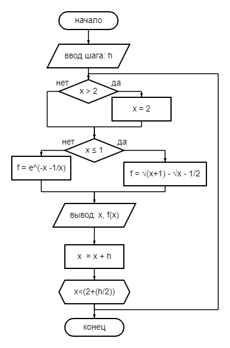
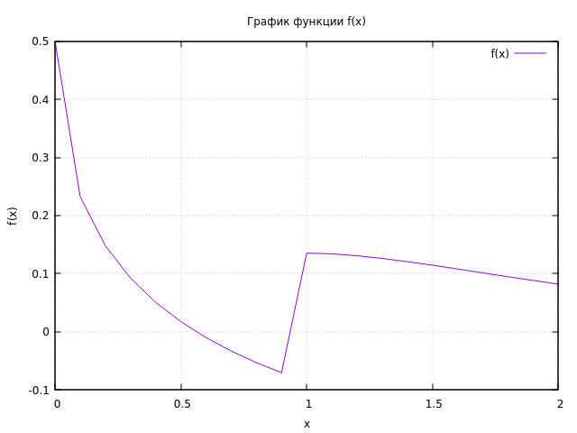
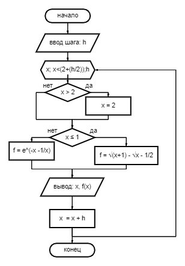

#  Лабораторная работа №2.
## Циклические алгоритмы.
### Задание.
Вывести таблицу значений и построить график функции с заданным шагом.
#### Вариант 4.
 $
 f(n) =
  \begin{cases}
 \sqrt(x+1) - \sqrt x - \frac{1}{2},  & \quad 0\leq x \leq 1;\\
    \mathrm{e}^{- x - \frac{1}{2}}, & \quad 1\leq x \leq 2.
  \end{cases}
 $

### Программа с использованием цикла `do while`.
 ```c
#include <stdio.h>
#include <math.h>
#include <stdlib.h>
#include <unistd.h>


int main(void)
{
    float x = 0.0;
    float f;
    float h;
    printf("Vvedite shag: \n");
    scanf("%f",&h);

    printf("\n");
    do {
        if (x > 2)
            x = 2;
        if (x<=1)
        f = sqrt(x + 1) - sqrt(x) - 0.5;
    else
        f = exp(-x-(1/x));
    printf("%f %f\n", x, f);
    x = x + h;
    } while (x<(2 + (h/2)));
}
 ```
### Программа с использованием цикла `for`.
 ```c
 #include <stdio.h>
#include <math.h>
#include <stdlib.h>
#include <unistd.h>


int main(void)
{
    float x = 0.0;
    float f;
    float h;
    printf("Vvedite shag: \n");
    scanf("%f",&h);

    printf("\n");
 for(x;x < (2+(h/2)); h)
    {
        if (x>2)
            x = 2;
        if (x<=1)
        f = sqrt(x+1) - sqrt(x) - 0.5;
    else 
        f = exp(-x-(1/x));
    printf("%f %f\n", x, f);
    x = x + h;
    }
}
 ```
 ### Как запустить код чтобы выводил график.
 1. Компилируем код `gcc lb2.c`(если выдаёт ошибку, то пишем `gcc lb2.c -lm`)
 2. Запускаем код для проверки `./a.out` или `./a.exe` если ос Windows.
 3. Переносим вывод кода в файл `./a.out > my_graph.txt`.
 4. Выполняем команду `chmod +x plot.gpi`.
 5. Вводим команду `./plot.gpi` и получаем график.
### Результаты программы и схемы.
#### do while


#### for


